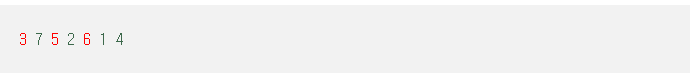

## LIS

> KOI 어린이집에는 N명의 아이들이 있다. 오늘은 소풍을 가는 날이다. 선생님은 1번부터 N번까지 번호가 적혀있는 번호표를 아이들의 가슴에 붙여주었다. 선생님은 아이들을 효과적으로 보호하기 위해 목적지까지 번호순서대로 일렬로 서서 걸어가도록 하였다. 이동 도중에 보니 아이들의 번호순서가 바뀌었다. 그래서 선생님은 다시 번호 순서대로 줄을 세우기 위해서 아이들의 위치를 옮기려고 한다. 그리고 아이들이 혼란스러워하지 않도록 하기 위해 위치를 옮기는 아이들의 수를 최소로 하려고 한다.

결국 문제에서 원하는 것은 다시 번호 순서대로 줄을 세우는 것이다.

뒤섞인 번호들을 다시 번호 순서대로 즉, 오름차순으로 정렬을 해야한다.

정렬하면서 움직이는 최소의 횟수를 구하는 문제다.


어떻게 보면 복잡하게 느껴질 수 있는 문제이다.

하지만 LIS 알고리즘을 알고 있다면, 쉽게 풀 수 있다.


3 7 5 2 6 1 4 입력이 주어졌을 경우를 보자.



입력된 수의 LIS를 찾으면 3 5 6 이 되는 것을 알 수 있다.

정답은 LIS가 아닌 나머지 수들의 개수가 최소가 된다.


이유는 번호 순서대로 정렬을 하면 된다.

그렇기에 연속적 또는 부분적으로 증가하고 있는 번호를 가진 아이들을 기준을 잡는 것이다.

그렇다면 복잡하지 않게 나머지 아이들을 옮기면 해결된다.


결국, LIS를 기준으로 아이들을 배치한 후 나머지 아이들을 옮김으로써, 최소를 구할 수 있게 된다.


```java
for (int i = 1; i < n; i++) { 
    dp[i] = 1; 
    for (int j = 0; j < i; j++) { 
        if (array[j] < array[i] && dp[j] + 1 > dp[i]) { 
            dp[i] = dp[j] + 1; 
        }
    } 
}

```

