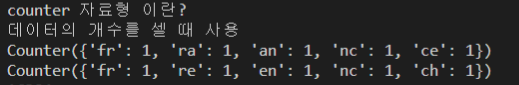

# [1차] 뉴스 클러스터링


- 정규화

  - re.compile('[a-z]{2}') 로 pattern을 만들고 search 를 이용해 확인할 수 있다.

- collections.Counter

  - 중복되는 개수를 허용하는 자료형

  - 교집합(&) 과 합집합(|) 을 제공한다.

  - counter 자료형의 형태 

    - 

  - ```python
    intersections = counter_1 &counter_2
    sum(list(intersections.values()))
    ```

- list 에 추가할때는 빈 list 를 만들고 `.append`

- 